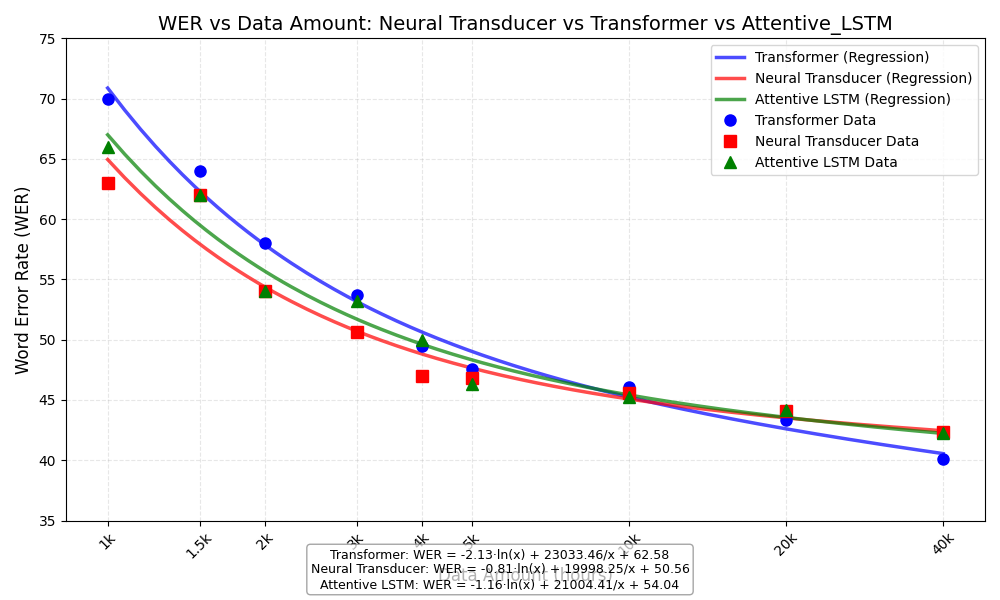

# Monolingual Results

| Language              | Pair n-Gram Model (baseline 2020) | Encoder-decoder Transformer (baseline 2020) | Neural Transducer (baseline 2021/22) | Attentive LSTM (baseline 2024) |
|-----------------------|---------------------------------------|-------------------------------------------------|------------------------------------------|------------------------------------|
| Adyghe                | 27                                    | 39                                              | 20                                       | 30                                 |
| Arabic                | 43                                    | 43                                              | 53                                       | 45                                 |
| Assamese              | 14                                    | 15                                              | 7                                        | 12                                 |
| Belarusian            | 7                                     | 6                                               | 2                                        | 2                                  |
| Bengali               | 70                                    | 78                                              | 68                                       | 67                                 |
| Bulgarian             | 37                                    | 30                                              | 32                                       | 27                                 |
| Burmese               | 39                                    | 41                                              | 29                                       | 35                                 |
| Cebuano               | 22                                    | 26                                              | 20                                       | 20                                 |
| Central Khmer         | 56                                    | 43                                              | 31                                       | 35                                 |
| Classical Persian     | 51                                    | 58                                              | 57                                       | 51                                 |
| Dutch                 | 32                                    | 29                                              | 24                                       | 23                                 |
| Eastern Armenian      | 17                                    | 16                                              | 15                                       | 20                                 |
| Eastern Lawa          | 44                                    | 24                                              | 8                                        | 12                                 |
| English               | 70                                    | 70                                              | 63                                       | 66                                 |
| French                | 31                                    | 29                                              | 23                                       | 27                                 |
| Georgian              | 0                                     | 4                                               | 0                                        | 1                                  |
| German                | 49                                    | 56                                              | 46                                       | 45                                 |
| Greek                 | 27                                    | 26                                              | 20                                       | 27                                 |
| Hindi                 | 23                                    | 24                                              | 11                                       | 13                                 |
| Hungarian             | 9                                     | 11                                              | 7                                        | 8                                  |
| Icelandic             | 35                                    | 24                                              | 12                                       | 16                                 |
| Indonesian            | 58                                    | 52                                              | 64                                       | 73                                 |
| Iranian Persian       | 66                                    | 63                                              | 65                                       | 65                                 |
| Irish                 | 57                                    | 46                                              | 43                                       | 39                                 |
| Italian               | 22                                    | 21                                              | 15                                       | 16                                 |
| Japanese              | 23                                    | 20                                              | 10                                       | 12                                 |
| Korean                | 81                                    | 89                                              | 23                                       | 100                                |
| Latvian               | 51                                    | 51                                              | 51                                       | 50                                 |
| Lithuanian            | 32                                    | 35                                              | 33                                       | 31                                 |
| Macedonian            | 6                                     | 5                                               | 5                                        | 5                                  |
| Maltese               | 27                                    | 24                                              | 17                                       | 22                                 |
| Norwegian Nynorsk     | 61                                    | 69                                              | 66                                       | 69                                 |
| Pashto                | 70                                    | 68                                              | 67                                       | 66                                 |
| Polish                | 9                                     | 8                                               | 4                                        | 7                                  |
| Romanian              | 10                                    | 17                                              | 9                                        | 17                                 |
| Russian               | 31                                    | 21                                              | 23                                       | 25                                 |
| Serbo-Croatian        | 84                                    | 69                                              | 64                                       | 69                                 |
| Shan                  | 6                                     | 10                                              | 5                                        | 4                                  |
| Slovenian             | 73                                    | 52                                              | 56                                       | 50                                 |
| Spanish               | 3                                     | 10                                              | 4                                        | 3                                  |
| Swedish               | 67                                    | 68                                              | 59                                       | 61                                 |
| Tagalog               | 11                                    | 17                                              | 13                                       | 11                                 |
| Thai                  | 70                                    | 49                                              | 39                                       | 42                                 |
| Ukrainian             | 27                                    | 26                                              | 19                                       | 18                                 |
| Urdu                  | 67                                    | 66                                              | 72                                       | 77                                 |
| Uyghur                | 0                                     | 3                                               | 0                                        | 2                                  |
| Vietnamese            | 44                                    | 20                                              | 5                                        | 4                                  |
| Welsh                 | 33                                    | 20                                              | 12                                       | 19                                 |
| **Macro-average WER** | **37.33**                             | **35.23**                                       | **28.98**                                | **32.06**                          |

## Error Analysis

### Korean

|        | Neutral Transducer | Encoder-Decoder Transformer | Attentive LSTM |
|--------|--------------------|-----------------------------|----------------|
| Hangul | 23                 | 89                          | 100            |
| Jamo   | 23                 | 28                          | 28             |

---

# How Data Amount Affects Performance of Transformer Model

Comparing best performing model and transformer on different amount fo English data

| Data Amount | Neutral Transducer | Encoder-Decoder Transformer | Attentive LSTM |
|-------------|--------------------|-----------------------------|----------------|
| 1k          | 63.00              | 70.00                       | 66.00          |
| 1.5k        | 62.00              | 64.00                       | 62.00          |
| 2k          | 54.00              | 58.00                       | 54.00          |
| 3k          | 50.67              | 53.67                       | 53.20          |
| 4k          | 47.00              | 49.50                       | 50.00          |
| 5k          | 46.80              | 47.60                       | 46.30          |
| 10k         | 45.60              | 46.10                       | 45.21          |
| 20k         | 44.05              | 43.35                       | 44.13          |
| 40k         | 42.38              | 40.10                       | 42.23          |

---

# Multilingual Approach

A tag comprising a language code (e.g. <|ENG|> for English, <|DEU|> for German) is prepended to each grapheme sequence
source. The datasets of each language are simply concatenated.

#### Does converting the language tag to the corresponding script of the language improve the model performance?

Using `slavic_cyrillic` dataset we got following validation WER:

| Tag in             | Neural Transducer | Encode-Decoder Transformer | Attentive LSTM |
|--------------------|-------------------|----------------------------|----------------|
| Uppercase Cyrillic | 39.67             | 28.00                      | 28.00          |
| Uppercase Latin    | 31.00             | 28.00                      | 27.00          |
| Lowercase Latin    | 32.33             | 28.00                      | 27.00          |
| No tag             | 45.00             | 44.67                      | 44.67          |

## Results

<!---
## How Language Family and Language Script affects
-->

### Same Language Family and Same Script

<table><thead>
  <tr>
    <th></th>
    <th></th>
    <th></th>
    <th colspan="3">Transducer</th>
    <th colspan="3">Transformer</th>
    <th colspan="3">Attentive LSTM</th>
    <th>ByT5</th>
  </tr></thead>
<tbody>
  <tr>
    <td>Family</td>
    <td>Script</td>
    <td>Language</td>
    <td>Multi</td>
    <td>Mono</td>
    <td>Δ</td>
    <td>Multi</td>
    <td>Mono</td>
    <td>Δ</td>
    <td>Multi</td>
    <td>Mono</td>
    <td>Δ</td>
    <td></td>
  </tr>
  <tr>
    <td rowspan="3">Indo-European (Germanic)</td>
    <td rowspan="3">Latin</td>
    <td>German</td>
    <td>45</td>
    <td>46</td>
    <td>-1</td>
    <td>50</td>
    <td>56</td>
    <td>-6</td>
    <td>45</td>
    <td>45</td>
    <td>0</td>
    <td>51</td>
  </tr>
  <tr>
    <td>Swedish</td>
    <td>60</td>
    <td>59</td>
    <td>1</td>
    <td>59</td>
    <td>68</td>
    <td>-9</td>
    <td>61</td>
    <td>61</td>
    <td>0</td>
    <td>64</td>
  </tr>
  <tr>
    <td>Dutch</td>
    <td>28</td>
    <td>24</td>
    <td>4</td>
    <td>20</td>
    <td>29</td>
    <td>-9</td>
    <td>21</td>
    <td>23</td>
    <td>-2</td>
    <td>22</td>
  </tr>
  <tr>
    <td colspan="3">Average</td>
    <td></td>
    <td></td>
    <td>1.33</td>
    <td></td>
    <td></td>
    <td>-8.00</td>
    <td></td>
    <td></td>
    <td>-0.67</td>
    <td></td>
  </tr>
  <tr>
    <td rowspan="3">Indo-European (Romance)</td>
    <td rowspan="3">Latin</td>
    <td>Italian</td>
    <td>30</td>
    <td>15</td>
    <td>15</td>
    <td>21</td>
    <td>21</td>
    <td>0</td>
    <td>17</td>
    <td>16</td>
    <td>1</td>
    <td>17</td>
  </tr>
  <tr>
    <td>Spanish</td>
    <td>11</td>
    <td>4</td>
    <td>7</td>
    <td>4</td>
    <td>10</td>
    <td>-6</td>
    <td>3</td>
    <td>3</td>
    <td>0</td>
    <td>3</td>
  </tr>
  <tr>
    <td>Romanian</td>
    <td>16</td>
    <td>9</td>
    <td>7</td>
    <td>17</td>
    <td>17</td>
    <td>0</td>
    <td>9</td>
    <td>17</td>
    <td>-8</td>
    <td>14</td>
  </tr>
  <tr>
    <td colspan="3">Average</td>
    <td></td>
    <td></td>
    <td>9.67</td>
    <td></td>
    <td></td>
    <td>-2.00</td>
    <td></td>
    <td></td>
    <td>-2.33</td>
    <td></td>
  </tr>
  <tr>
    <td rowspan="3">Indo-European (Slavic)</td>
    <td rowspan="3">Cyrillic</td>
    <td>Russian</td>
    <td>27</td>
    <td>23</td>
    <td>4</td>
    <td>18</td>
    <td>21</td>
    <td>-3</td>
    <td>22</td>
    <td>25</td>
    <td>-3</td>
    <td>24</td>
  </tr>
  <tr>
    <td>Ukrainian</td>
    <td>22</td>
    <td>19</td>
    <td>3</td>
    <td>27</td>
    <td>26</td>
    <td>1</td>
    <td>19</td>
    <td>18</td>
    <td>1</td>
    <td>35</td>
  </tr>
  <tr>
    <td>Bulgarian</td>
    <td>35</td>
    <td>32</td>
    <td>3</td>
    <td>27</td>
    <td>30</td>
    <td>-3</td>
    <td>31</td>
    <td>27</td>
    <td>4</td>
    <td>27</td>
  </tr>
  <tr>
    <td colspan="3">Average</td>
    <td></td>
    <td></td>
    <td>3.33</td>
    <td></td>
    <td></td>
    <td>-1.67</td>
    <td></td>
    <td></td>
    <td>0.67</td>
    <td></td>
  </tr>
  <tr>
    <td rowspan="3">Indo-European (Slavic)</td>
    <td rowspan="3">Latin</td>
    <td>Serbo-Croatian</td>
    <td>67</td>
    <td>64</td>
    <td>3</td>
    <td>63</td>
    <td>69</td>
    <td>-6</td>
    <td>68</td>
    <td>69</td>
    <td>-1</td>
    <td>62</td>
  </tr>
  <tr>
    <td>Polish</td>
    <td>13</td>
    <td>4</td>
    <td>9</td>
    <td>9</td>
    <td>8</td>
    <td>1</td>
    <td>9</td>
    <td>7</td>
    <td>2</td>
    <td>8</td>
  </tr>
  <tr>
    <td>Slovenian</td>
    <td>59</td>
    <td>56</td>
    <td>3</td>
    <td>52</td>
    <td>52</td>
    <td>0</td>
    <td>50</td>
    <td>50</td>
    <td>0</td>
    <td>53</td>
  </tr>
  <tr>
    <td colspan="3">Average</td>
    <td></td>
    <td></td>
    <td>5.00</td>
    <td></td>
    <td></td>
    <td>-1.67</td>
    <td></td>
    <td></td>
    <td>0.33</td>
    <td></td>
  </tr>
  <tr>
    <td rowspan="3">Indo-European (Indo-Iranian)</td>
    <td rowspan="3">Arabic</td>
    <td>Pashto</td>
    <td>80</td>
    <td>67</td>
    <td>13</td>
    <td>67</td>
    <td>68</td>
    <td>-1</td>
    <td>68</td>
    <td>66</td>
    <td>2</td>
    <td>70</td>
  </tr>
  <tr>
    <td>Classical Persian</td>
    <td>63</td>
    <td>57</td>
    <td>6</td>
    <td>53</td>
    <td>58</td>
    <td>-5</td>
    <td>59</td>
    <td>51</td>
    <td>8</td>
    <td>45</td>
  </tr>
  <tr>
    <td>Urdu</td>
    <td>77</td>
    <td>72</td>
    <td>5</td>
    <td>67</td>
    <td>66</td>
    <td>1</td>
    <td>69</td>
    <td>77</td>
    <td>-8</td>
    <td>62</td>
  </tr>
  <tr>
    <td colspan="3">Average</td>
    <td></td>
    <td></td>
    <td>8.00</td>
    <td></td>
    <td></td>
    <td>-1.67</td>
    <td></td>
    <td></td>
    <td>0.67</td>
    <td></td>
  </tr>
  <tr>
    <td rowspan="3">Austronesian</td>
    <td rowspan="3">Latin</td>
    <td>Indonesian</td>
    <td>66</td>
    <td>64</td>
    <td>2</td>
    <td>57</td>
    <td>52</td>
    <td>5</td>
    <td>55</td>
    <td>73</td>
    <td>-18</td>
    <td>51</td>
  </tr>
  <tr>
    <td>Cebuano</td>
    <td>26</td>
    <td>13</td>
    <td>13</td>
    <td>24</td>
    <td>26</td>
    <td>-2</td>
    <td>22</td>
    <td>20</td>
    <td>2</td>
    <td>26</td>
  </tr>
  <tr>
    <td>Tagalog</td>
    <td>15</td>
    <td>20</td>
    <td>-5</td>
    <td>18</td>
    <td>17</td>
    <td>1</td>
    <td>16</td>
    <td>11</td>
    <td>5</td>
    <td>10</td>
  </tr>
  <tr>
    <td colspan="3">Average</td>
    <td></td>
    <td></td>
    <td>3.33</td>
    <td></td>
    <td></td>
    <td>1.33</td>
    <td></td>
    <td></td>
    <td>-3.67</td>
    <td></td>
  </tr>
</tbody></table>

### Different Language Family and Same Script

<table><thead>
  <tr>
    <th></th>
    <th></th>
    <th></th>
    <th colspan="3">Transducer</th>
    <th colspan="3">Transformer</th>
    <th colspan="3">Attentive LSTM</th>
    <th>ByT5</th>
  </tr></thead>
<tbody>
  <tr>
    <td>Family</td>
    <td>Script</td>
    <td>Language</td>
    <td>Multi</td>
    <td>Mono</td>
    <td>Δ</td>
    <td>Multi</td>
    <td>Mono</td>
    <td>Δ</td>
    <td>Multi</td>
    <td>Mono</td>
    <td>Δ</td>
    <td></td>
  </tr>
  <tr>
    <td>Afro-Asiatic</td>
    <td rowspan="3">Arabic</td>
    <td>Arabic</td>
    <td>54</td>
    <td>53</td>
    <td>1</td>
    <td>38</td>
    <td>43</td>
    <td>-5</td>
    <td>40</td>
    <td>45</td>
    <td>-5</td>
    <td>42</td>
  </tr>
  <tr>
    <td>Indo-European</td>
    <td>Classical Persian</td>
    <td>58</td>
    <td>57</td>
    <td>1</td>
    <td>42</td>
    <td>58</td>
    <td>-16</td>
    <td>45</td>
    <td>51</td>
    <td>-6</td>
    <td>45</td>
  </tr>
  <tr>
    <td>Turkic</td>
    <td>Uyghur</td>
    <td>10</td>
    <td>0</td>
    <td>10</td>
    <td>3</td>
    <td>3</td>
    <td>0</td>
    <td>2</td>
    <td>2</td>
    <td>0</td>
    <td>0</td>
  </tr>
  <tr>
    <td colspan="3">Average</td>
    <td></td>
    <td></td>
    <td>4.00</td>
    <td></td>
    <td></td>
    <td>-7.00</td>
    <td></td>
    <td></td>
    <td>-3.67</td>
    <td></td>
  </tr>
  <tr>
    <td>Indo-European</td>
    <td rowspan="3">Latin</td>
    <td>Italian</td>
    <td>18</td>
    <td>15</td>
    <td>3</td>
    <td>25</td>
    <td>21</td>
    <td>4</td>
    <td>25</td>
    <td>16</td>
    <td>9</td>
    <td>17</td>
  </tr>
  <tr>
    <td>Austronesian</td>
    <td>Indonesian</td>
    <td>58</td>
    <td>64</td>
    <td>-6</td>
    <td>52</td>
    <td>52</td>
    <td>0</td>
    <td>53</td>
    <td>73</td>
    <td>-20</td>
    <td>51</td>
  </tr>
  <tr>
    <td>Uralic</td>
    <td>Hungarian</td>
    <td>8</td>
    <td>7</td>
    <td>1</td>
    <td>10</td>
    <td>11</td>
    <td>-1</td>
    <td>6</td>
    <td>8</td>
    <td>-2</td>
    <td>10</td>
  </tr>
  <tr>
    <td colspan="3">Average</td>
    <td></td>
    <td></td>
    <td>-0.67</td>
    <td></td>
    <td></td>
    <td>1.00</td>
    <td></td>
    <td></td>
    <td>-4.33</td>
    <td></td>
  </tr>
</tbody></table>

#### Larger Model/Dataset

<table><thead>
  <tr>
    <th></th>
    <th></th>
    <th></th>
    <th colspan="3">Transducer</th>
    <th colspan="3">Transformer</th>
    <th colspan="3">Attentive LSTM</th>
    <th>ByT5</th>
  </tr></thead>
<tbody>
  <tr>
    <td>Family</td>
    <td>Script</td>
    <td>Language</td>
    <td>Multi</td>
    <td>Mono</td>
    <td>Δ</td>
    <td>Multi</td>
    <td>Mono</td>
    <td>Δ</td>
    <td>Multi</td>
    <td>Mono</td>
    <td>Δ</td>
    <td></td>
  </tr>
  <tr>
    <td>Indo-European</td>
    <td rowspan="4">Latin</td>
    <td>Italian</td>
    <td>16</td>
    <td>15</td>
    <td>1</td>
    <td>22</td>
    <td>21</td>
    <td>1</td>
    <td>19</td>
    <td>16</td>
    <td>3</td>
    <td>17</td>
  </tr>
  <tr>
    <td>Austronesian</td>
    <td>Indonesian</td>
    <td>56</td>
    <td>64</td>
    <td>-8</td>
    <td>52</td>
    <td>52</td>
    <td>0</td>
    <td>57</td>
    <td>73</td>
    <td>-16</td>
    <td>51</td>
  </tr>
  <tr>
    <td>Uralic</td>
    <td>Hungarian</td>
    <td>9</td>
    <td>7</td>
    <td>2</td>
    <td>12</td>
    <td>11</td>
    <td>1</td>
    <td>7</td>
    <td>8</td>
    <td>-1</td>
    <td>10</td>
  </tr>
  <tr>
    <td>Afro-Asiatic</td>
    <td>Maltese</td>
    <td>19</td>
    <td>17</td>
    <td>2</td>
    <td>18</td>
    <td>24</td>
    <td>-6</td>
    <td>17</td>
    <td>22</td>
    <td>-5</td>
    <td>19</td>
  </tr>
  <tr>
    <td colspan="3">Average</td>
    <td></td>
    <td></td>
    <td>-0.75</td>
    <td></td>
    <td></td>
    <td>-1.00</td>
    <td></td>
    <td></td>
    <td>-4.75</td>
    <td></td>
  </tr>
</tbody></table>

### Same Language Family and Different Script

<table><thead>
  <tr>
    <th></th>
    <th></th>
    <th></th>
    <th colspan="3">Transducer</th>
    <th colspan="3">Transformer</th>
    <th colspan="3">Attentive LSTM</th>
    <th>ByT5</th>
  </tr></thead>
<tbody>
  <tr>
    <td>Family</td>
    <td>Script</td>
    <td>Language</td>
    <td>Multi</td>
    <td>Mono</td>
    <td>Δ</td>
    <td>Multi</td>
    <td>Mono</td>
    <td>Δ</td>
    <td>Multi</td>
    <td>Mono</td>
    <td>Δ</td>
    <td></td>
  </tr>
  <tr>
    <td rowspan="3">Indo-European</td>
    <td>Arabic</td>
    <td>Classical Persian</td>
    <td>63</td>
    <td>57</td>
    <td>6</td>
    <td>40</td>
    <td>58</td>
    <td>-18</td>
    <td>44</td>
    <td>51</td>
    <td>-7</td>
    <td>45</td>
  </tr>
  <tr>
    <td>Cyrillic</td>
    <td>Russian</td>
    <td>46</td>
    <td>23</td>
    <td>23</td>
    <td>21</td>
    <td>21</td>
    <td>0</td>
    <td>24</td>
    <td>25</td>
    <td>-1</td>
    <td>24</td>
  </tr>
  <tr>
    <td>Latin</td>
    <td>Italian</td>
    <td>20</td>
    <td>15</td>
    <td>5</td>
    <td>22</td>
    <td>21</td>
    <td>1</td>
    <td>18</td>
    <td>16</td>
    <td>2</td>
    <td>17</td>
  </tr>
  <tr>
    <td colspan="3">Average</td>
    <td></td>
    <td></td>
    <td>11.33</td>
    <td></td>
    <td></td>
    <td>-5.67</td>
    <td></td>
    <td></td>
    <td>-2.00</td>
    <td></td>
  </tr>
</tbody></table>

#### Larger Model/Dataset

<table><thead>
  <tr>
    <th></th>
    <th></th>
    <th></th>
    <th colspan="3">Transducer</th>
    <th colspan="3">Transformer</th>
    <th colspan="3">Attentive LSTM</th>
    <th>ByT5</th>
  </tr></thead>
<tbody>
  <tr>
    <td>Family</td>
    <td>Script</td>
    <td>Language</td>
    <td>Multi</td>
    <td>Mono</td>
    <td>Δ</td>
    <td>Multi</td>
    <td>Mono</td>
    <td>Δ</td>
    <td>Multi</td>
    <td>Mono</td>
    <td>Δ</td>
    <td></td>
  </tr>
  <tr>
    <td rowspan="4">Indo-European</td>
    <td>Arabic</td>
    <td>Classical Persian</td>
    <td>50</td>
    <td>57</td>
    <td>-7</td>
    <td>43</td>
    <td>58</td>
    <td>-15</td>
    <td>44</td>
    <td>51</td>
    <td>-7</td>
    <td>45</td>
  </tr>
  <tr>
    <td>Cyrillic</td>
    <td>Russian</td>
    <td>34</td>
    <td>23</td>
    <td>11</td>
    <td>26</td>
    <td>21</td>
    <td>5</td>
    <td>26</td>
    <td>25</td>
    <td>1</td>
    <td>24</td>
  </tr>
  <tr>
    <td>Latin</td>
    <td>Italian</td>
    <td>23</td>
    <td>15</td>
    <td>8</td>
    <td>24</td>
    <td>21</td>
    <td>3</td>
    <td>18</td>
    <td>16</td>
    <td>2</td>
    <td>17</td>
  </tr>
  <tr>
    <td>Armenian</td>
    <td>Eastern Armenian</td>
    <td>19</td>
    <td>15</td>
    <td>4</td>
    <td>16</td>
    <td>16</td>
    <td>0</td>
    <td>18</td>
    <td>20</td>
    <td>-2</td>
    <td>25</td>
  </tr>
  <tr>
    <td colspan="3">Average</td>
    <td></td>
    <td></td>
    <td>4.00</td>
    <td></td>
    <td></td>
    <td>-1.75</td>
    <td></td>
    <td></td>
    <td>-1.50</td>
    <td></td>
  </tr>
</tbody></table>

## Effect of Transliteration

### Latin transliteration of languages with Cyrillic script

#### Monolingual

<table><thead>
  <tr>
    <th></th>
    <th colspan="3">Transducer</th>
    <th colspan="3">Transformer</th>
    <th colspan="3">Attentive LSTM</th>
  </tr></thead>
<tbody>
  <tr>
    <td></td>
    <td>Latin</td>
    <td>Cyrillic</td>
    <td>Δ</td>
    <td>Latin</td>
    <td>Cyrillic</td>
    <td>Δ</td>
    <td>Latin</td>
    <td>Cyrillic</td>
    <td>Δ</td>
  </tr>
  <tr>
    <td>Russian</td>
    <td>20</td>
    <td>23</td>
    <td>-3</td>
    <td>22</td>
    <td>21</td>
    <td>1</td>
    <td>25</td>
    <td>30</td>
    <td>-5</td>
  </tr>
  <tr>
    <td>Ukrainian</td>
    <td>22</td>
    <td>19</td>
    <td>3</td>
    <td>24</td>
    <td>26</td>
    <td>-2</td>
    <td>18</td>
    <td>20</td>
    <td>-2</td>
  </tr>
  <tr>
    <td>Bulgarian</td>
    <td>34</td>
    <td>32</td>
    <td>2</td>
    <td>35</td>
    <td>30</td>
    <td>5</td>
    <td>27</td>
    <td>29</td>
    <td>-2</td>
  </tr>
  <tr>
    <td>Macedonian</td>
    <td>6</td>
    <td>5</td>
    <td>1</td>
    <td>5</td>
    <td>5</td>
    <td>0</td>
    <td>5</td>
    <td>5</td>
    <td>0</td>
  </tr>
  <tr>
    <td>Average</td>
    <td></td>
    <td></td>
    <td>0.75</td>
    <td></td>
    <td></td>
    <td>1.00</td>
    <td></td>
    <td></td>
    <td>-2.25</td>
  </tr>
</tbody></table>

#### Multilingual Dataset - Slavic Latin

<table><thead>
  <tr>
    <th></th>
    <th colspan="3">Transducer</th>
    <th colspan="3">Transformer</th>
    <th colspan="3">Attentive LSTM</th>
    <th>ByT5</th>
  </tr></thead>
<tbody>
  <tr>
    <td>Language</td>
    <td>Multi</td>
    <td>Mono</td>
    <td>Δ</td>
    <td>Multi</td>
    <td>Mono</td>
    <td>Δ</td>
    <td>Multi</td>
    <td>Mono</td>
    <td>Δ</td>
    <td></td>
  </tr>
  <tr>
    <td>Bulgarian*</td>
    <td>31</td>
    <td>34</td>
    <td>-3</td>
    <td>27</td>
    <td>35</td>
    <td>-8</td>
    <td>23</td>
    <td>27</td>
    <td>-4</td>
    <td>28</td>
  </tr>
  <tr>
    <td>Russian*</td>
    <td>19</td>
    <td>20</td>
    <td>-1</td>
    <td>24</td>
    <td>22</td>
    <td>2</td>
    <td>20</td>
    <td>25</td>
    <td>-5</td>
    <td>31</td>
  </tr>
  <tr>
    <td>Ukrainian*</td>
    <td>23</td>
    <td>22</td>
    <td>1</td>
    <td>18</td>
    <td>24</td>
    <td>-6</td>
    <td>19</td>
    <td>18</td>
    <td>1</td>
    <td>34</td>
  </tr>
  <tr>
    <td>Serbo-Croatian</td>
    <td>76</td>
    <td>64</td>
    <td>12</td>
    <td>63</td>
    <td>69</td>
    <td>-6</td>
    <td>61</td>
    <td>69</td>
    <td>-8</td>
    <td>62</td>
  </tr>
  <tr>
    <td>Polish</td>
    <td>13</td>
    <td>4</td>
    <td>9</td>
    <td>7</td>
    <td>8</td>
    <td>-1</td>
    <td>8</td>
    <td>7</td>
    <td>1</td>
    <td>8</td>
  </tr>
  <tr>
    <td>Slovenian</td>
    <td>54</td>
    <td>56</td>
    <td>-2</td>
    <td>57</td>
    <td>52</td>
    <td>5</td>
    <td>49</td>
    <td>50</td>
    <td>-1</td>
    <td>53</td>
  </tr>
  <tr>
    <td>Macedonian*</td>
    <td>4</td>
    <td>6</td>
    <td>-2</td>
    <td>3</td>
    <td>5</td>
    <td>-2</td>
    <td>4</td>
    <td>5</td>
    <td>-1</td>
    <td>6</td>
  </tr>
  <tr>
    <td>Average</td>
    <td></td>
    <td></td>
    <td>2.00</td>
    <td></td>
    <td></td>
    <td>-2.29</td>
    <td></td>
    <td></td>
    <td>-2.43</td>
    <td></td>
  </tr>
</tbody></table>

### Latin transliteration of languages with Arabic script

#### Monolingual

<table><thead>
  <tr>
    <th></th>
    <th colspan="4">Transducer</th>
    <th colspan="4">Transformer</th>
    <th colspan="4">Attentive LSTM</th>
  </tr></thead>
<tbody>
  <tr>
    <td></td>
    <td>uroman</td>
    <td>epitran</td>
    <td>Arabic</td>
    <td>Δ</td>
    <td>uroman</td>
    <td>epitran</td>
    <td>Arabic</td>
    <td>Δ</td>
    <td>uroman</td>
    <td>epitran</td>
    <td>Arabic</td>
    <td>Δ</td>
  </tr>
  <tr>
    <td>Arabic</td>
    <td>70</td>
    <td>63</td>
    <td>53</td>
    <td>17</td>
    <td>67</td>
    <td>60</td>
    <td>43</td>
    <td>24</td>
    <td>70</td>
    <td>56</td>
    <td>45</td>
    <td>25</td>
  </tr>
  <tr>
    <td>Classical Persian</td>
    <td>48</td>
    <td>58</td>
    <td>57</td>
    <td>-9</td>
    <td>49</td>
    <td>59</td>
    <td>58</td>
    <td>-9</td>
    <td>50</td>
    <td>56</td>
    <td>51</td>
    <td>-1</td>
  </tr>
  <tr>
    <td>Pashto</td>
    <td>74</td>
    <td>/</td>
    <td>67</td>
    <td>7</td>
    <td>76</td>
    <td>/</td>
    <td>68</td>
    <td>8</td>
    <td>72</td>
    <td>/</td>
    <td>66</td>
    <td>6</td>
  </tr>
  <tr>
    <td>Urdu</td>
    <td>72</td>
    <td>73</td>
    <td>72</td>
    <td>0</td>
    <td>67</td>
    <td>67</td>
    <td>66</td>
    <td>1</td>
    <td>78</td>
    <td>75</td>
    <td>77</td>
    <td>1</td>
  </tr>
  <tr>
    <td>Uyghur</td>
    <td>28</td>
    <td>4</td>
    <td>0</td>
    <td>28</td>
    <td>38</td>
    <td>4</td>
    <td>3</td>
    <td>35</td>
    <td>35</td>
    <td>4</td>
    <td>2</td>
    <td>33</td>
  </tr>
  <tr>
    <td>Average</td>
    <td></td>
    <td></td>
    <td></td>
    <td>8.6</td>
    <td></td>
    <td></td>
    <td></td>
    <td>11.8</td>
    <td></td>
    <td></td>
    <td></td>
    <td>12.8</td>
  </tr>
</tbody></table>

#### Multilingual(uroman)

<table><thead>
  <tr>
    <th></th>
    <th colspan="3">Transducer</th>
    <th colspan="3">Transformer</th>
    <th colspan="3">Attentive LSTM</th>
  </tr></thead>
<tbody>
  <tr>
    <td></td>
    <td>Multi</td>
    <td>Mono</td>
    <td>Δ</td>
    <td>Multi</td>
    <td>Mono</td>
    <td>Δ</td>
    <td>Multi</td>
    <td>Mono</td>
    <td>Δ</td>
  </tr>
  <tr>
    <td>Arabic*</td>
    <td>76</td>
    <td>70</td>
    <td>6</td>
    <td>42</td>
    <td>67</td>
    <td>-25</td>
    <td>65</td>
    <td>70</td>
    <td>-5</td>
  </tr>
  <tr>
    <td>Classical Persian*</td>
    <td>66</td>
    <td>48</td>
    <td>14</td>
    <td>42</td>
    <td>49</td>
    <td>-7</td>
    <td>50</td>
    <td>50</td>
    <td>0</td>
  </tr>
  <tr>
    <td>Urdu*</td>
    <td>82</td>
    <td>72</td>
    <td>10</td>
    <td>64</td>
    <td>67</td>
    <td>-3</td>
    <td>70</td>
    <td>78</td>
    <td>-8</td>
  </tr>
  <tr>
    <td>Uyghur*</td>
    <td>37</td>
    <td>28</td>
    <td>9</td>
    <td>36</td>
    <td>38</td>
    <td>-2</td>
    <td>33</td>
    <td>35</td>
    <td>-2</td>
  </tr>
  <tr>
    <td>Average</td>
    <td></td>
    <td></td>
    <td>9.4</td>
    <td></td>
    <td></td>
    <td>-8.6</td>
    <td></td>
    <td></td>
    <td>-2.6</td>
  </tr>
</tbody></table>

#### Multilingual(epitran)

<table><thead>
  <tr>
    <th></th>
    <th colspan="3">Transducer</th>
    <th colspan="3">Transformer</th>
    <th colspan="3">Attentive LSTM</th>
  </tr></thead>
<tbody>
  <tr>
    <td></td>
    <td>Multi</td>
    <td>Mono</td>
    <td>Δ</td>
    <td>Multi</td>
    <td>Mono</td>
    <td>Δ</td>
    <td>Multi</td>
    <td>Mono</td>
    <td>Δ</td>
  </tr>
  <tr>
    <td>Arabic*</td>
    <td>58</td>
    <td>63</td>
    <td>-5</td>
    <td></td>
    <td>60</td>
    <td></td>
    <td>36</td>
    <td>56</td>
    <td>-20</td>
  </tr>
  <tr>
    <td>Classical Persian*</td>
    <td>66</td>
    <td>58</td>
    <td>8</td>
    <td></td>
    <td>59</td>
    <td></td>
    <td>44</td>
    <td>56</td>
    <td>-12</td>
  </tr>
  <tr>
    <td>Urdu*</td>
    <td>77</td>
    <td>73</td>
    <td>4</td>
    <td></td>
    <td>67</td>
    <td></td>
    <td>62</td>
    <td>75</td>
    <td>-13</td>
  </tr>
  <tr>
    <td>Uyghur*</td>
    <td>10</td>
    <td>4</td>
    <td>6</td>
    <td></td>
    <td>4</td>
    <td></td>
    <td>4</td>
    <td>4</td>
    <td>0</td>
  </tr>
  <tr>
    <td>Average</td>
    <td></td>
    <td></td>
    <td>3.3</td>
    <td></td>
    <td></td>
    <td></td>
    <td></td>
    <td></td>
    <td></td>
  </tr>
</tbody></table>

### Latin transliteration of Indo-European languages

#### Monolingual

<table><thead>
  <tr>
    <th></th>
    <th colspan="3">Transducer</th>
    <th colspan="3">Transformer</th>
    <th colspan="3">Attentive LSTM</th>
  </tr></thead>
<tbody>
  <tr>
    <td></td>
    <td>Latin</td>
    <td>Armenian</td>
    <td>Δ</td>
    <td>Latin</td>
    <td>Armenian</td>
    <td>Δ</td>
    <td>Latin</td>
    <td>Armenian</td>
    <td>Δ</td>
  </tr>
  <tr>
    <td>Eastern Armenian</td>
    <td>40</td>
    <td>15</td>
    <td>25</td>
    <td>43</td>
    <td>16</td>
    <td>27</td>
    <td>39</td>
    <td>20</td>
    <td>19</td>
  </tr>
  <tr>
    <td></td>
    <td>Latin</td>
    <td>Greek</td>
    <td>Δ</td>
    <td>Latin</td>
    <td>Greek</td>
    <td>Δ</td>
    <td>Latin</td>
    <td>Greek</td>
    <td>Δ</td>
  </tr>
  <tr>
    <td>Greek</td>
    <td>30</td>
    <td>20</td>
    <td>10</td>
    <td>35</td>
    <td>26</td>
    <td>9</td>
    <td>35</td>
    <td>27</td>
    <td>8</td>
  </tr>
</tbody></table>

#### Multilingual

<table><thead>
  <tr>
    <th></th>
    <th colspan="3">Transducer</th>
    <th colspan="3">Transformer</th>
    <th colspan="3">Attentive LSTM</th>
  </tr></thead>
<tbody>
  <tr>
    <td></td>
    <td>Multi</td>
    <td>Mono</td>
    <td>Δ</td>
    <td>Multi</td>
    <td>Mono</td>
    <td>Δ</td>
    <td>Multi</td>
    <td>Mono</td>
    <td>Δ</td>
  </tr>
  <tr>
    <td>Classical Persian*</td>
    <td>58</td>
    <td>48</td>
    <td>10</td>
    <td>50</td>
    <td>49</td>
    <td>1</td>
    <td>46</td>
    <td>50</td>
    <td>-4</td>
  </tr>
  <tr>
    <td>Russian*</td>
    <td>39</td>
    <td>20</td>
    <td>19</td>
    <td>29</td>
    <td>22</td>
    <td>7</td>
    <td>30</td>
    <td>27</td>
    <td>3</td>
  </tr>
  <tr>
    <td>Italian</td>
    <td>21</td>
    <td>15</td>
    <td>6</td>
    <td>19</td>
    <td>21</td>
    <td>-2</td>
    <td>15</td>
    <td>16</td>
    <td>-1</td>
  </tr>
  <tr>
    <td>Eastern Armenian*</td>
    <td>45</td>
    <td>40</td>
    <td>5</td>
    <td>40</td>
    <td>43</td>
    <td>-3</td>
    <td>42</td>
    <td>39</td>
    <td>3</td>
  </tr>
  <tr>
    <td>German</td>
    <td>47</td>
    <td>46</td>
    <td>1</td>
    <td>45</td>
    <td>56</td>
    <td>-11</td>
    <td>51</td>
    <td>45</td>
    <td>6</td>
  </tr>
  <tr>
    <td>Greek*</td>
    <td>32</td>
    <td>30</td>
    <td>2</td>
    <td>33</td>
    <td>35</td>
    <td>-2</td>
    <td>33</td>
    <td>35</td>
    <td>-2</td>
  </tr>
  <tr>
    <td>Irish</td>
    <td>45</td>
    <td>43</td>
    <td>2</td>
    <td>43</td>
    <td>46</td>
    <td>-3</td>
    <td>41</td>
    <td>39</td>
    <td>2</td>
  </tr>
  <tr>
    <td>Average</td>
    <td></td>
    <td></td>
    <td>6.43</td>
    <td></td>
    <td></td>
    <td>-1.86</td>
    <td></td>
    <td></td>
    <td>1.00</td>
  </tr>
</tbody></table>

## Influence of Languages on each other in a dataset

### Language Family and Script

<table><tbody>
  <tr>
    <td></td>
    <td colspan="3">Italian</td>
    <td rowspan="5"></td>
    <td colspan="3">Classical Persian</td>
  </tr>
  <tr>
    <td></td>
    <td>1F1S</td>
    <td>DF1S</td>
    <td>1FDS</td>
    <td>1F1S</td>
    <td>DF1S</td>
    <td>1FDS</td>
  </tr>
  <tr>
    <td>Transducer</td>
    <td>30</td>
    <td>18</td>
    <td>20</td>
    <td>63</td>
    <td>58</td>
    <td>63</td>
  </tr>
  <tr>
    <td>Transformer</td>
    <td>21</td>
    <td>25</td>
    <td>22</td>
    <td>53</td>
    <td>42</td>
    <td>40</td>
  </tr>
  <tr>
    <td>Attentive LSTM</td>
    <td>17</td>
    <td>25</td>
    <td>18</td>
    <td>59</td>
    <td>45</td>
    <td>44</td>
  </tr>
  <tr>
    <td></td>
    <td colspan="3">Indonesian</td>
    <td rowspan="4"></td>
    <td colspan="3">Russian</td>
  </tr>
  <tr>
    <td>Transducer</td>
    <td>66</td>
    <td>58</td>
    <td></td>
    <td>27</td>
    <td></td>
    <td>46</td>
  </tr>
  <tr>
    <td>Transformer</td>
    <td>57</td>
    <td>52</td>
    <td></td>
    <td>18</td>
    <td></td>
    <td>21</td>
  </tr>
  <tr>
    <td>Attentive LSTM</td>
    <td>55</td>
    <td>53</td>
    <td></td>
    <td>22</td>
    <td></td>
    <td>24</td>
  </tr>
</tbody></table>

### Classical/Iranian Persian and Uyghur

<table><thead>
  <tr>
    <th></th>
    <th colspan="3">Transducer</th>
    <th colspan="3">Transformer</th>
    <th colspan="3">Attentive LSTM</th>
  </tr></thead>
<tbody>
  <tr>
    <td>Language</td>
    <td>Multi</td>
    <td>Mono</td>
    <td>Δ</td>
    <td>Multi</td>
    <td>Mono</td>
    <td>Δ</td>
    <td>Multi</td>
    <td>Mono</td>
    <td>Δ</td>
  </tr>
  <tr>
    <td>Arabic</td>
    <td>54</td>
    <td>53</td>
    <td>1</td>
    <td>38</td>
    <td>43</td>
    <td>-5</td>
    <td>40</td>
    <td>45</td>
    <td>-5</td>
  </tr>
  <tr>
    <td>Classical Persian</td>
    <td>58</td>
    <td>57</td>
    <td>1</td>
    <td>42</td>
    <td>58</td>
    <td>-16</td>
    <td>45</td>
    <td>51</td>
    <td>-6</td>
  </tr>
  <tr>
    <td>Uyghur</td>
    <td>10</td>
    <td>0</td>
    <td>10</td>
    <td>3</td>
    <td>3</td>
    <td>0</td>
    <td>2</td>
    <td>2</td>
    <td>0</td>
  </tr>
  <tr>
    <td colspan="10"></td>
  </tr>
  <tr>
    <td>Arabic</td>
    <td>68</td>
    <td>53</td>
    <td>15</td>
    <td>39</td>
    <td>43</td>
    <td>-4</td>
    <td>43</td>
    <td>45</td>
    <td>-2</td>
  </tr>
  <tr>
    <td>Iranian Persian</td>
    <td>68</td>
    <td>65</td>
    <td>3</td>
    <td>61</td>
    <td>63</td>
    <td>-2</td>
    <td>63</td>
    <td>65</td>
    <td>-2</td>
  </tr>
  <tr>
    <td>Uyghur</td>
    <td>11</td>
    <td>0</td>
    <td>11</td>
    <td>3</td>
    <td>3</td>
    <td>0</td>
    <td>2</td>
    <td>2</td>
    <td>0</td>
  </tr>
</tbody></table>

### Maltese

<table><thead>
  <tr>
    <th></th>
    <th colspan="3">Transducer</th>
    <th colspan="3">Transformer</th>
    <th colspan="3">Attentive LSTM</th>
  </tr></thead>
<tbody>
  <tr>
    <td>Language</td>
    <td>Multi</td>
    <td>Mono</td>
    <td>Δ</td>
    <td>Multi</td>
    <td>Mono</td>
    <td>Δ</td>
    <td>Multi</td>
    <td>Mono</td>
    <td>Δ</td>
  </tr>
  <tr>
    <td>Italian</td>
    <td>28</td>
    <td>15</td>
    <td>13</td>
    <td>23</td>
    <td>21</td>
    <td>2</td>
    <td>17</td>
    <td>16</td>
    <td>1</td>
  </tr>
  <tr>
    <td>Maltese</td>
    <td>30</td>
    <td>17</td>
    <td>13</td>
    <td>16</td>
    <td>24</td>
    <td>-8</td>
    <td>19</td>
    <td>22</td>
    <td>-3</td>
  </tr>
  <tr>
    <td>Arabic*</td>
    <td>77</td>
    <td>70</td>
    <td>7</td>
    <td>47</td>
    <td>67</td>
    <td>-20</td>
    <td>50</td>
    <td>70</td>
    <td>-20</td>
  </tr>
  <tr>
    <td>Average</td>
    <td></td>
    <td></td>
    <td>11.00</td>
    <td></td>
    <td></td>
    <td>-8.67</td>
    <td></td>
    <td></td>
    <td>-7.33</td>
  </tr>
</tbody></table>

--- 

# Reference Result from previous shared task

## 2022

### Model

**Baseline**: A neural transducer system using an imitation learning paradigm (dyNET framework)

**Submissions**:

1. [Tü-G2P](https://aclanthology.org/2023.sigmorphon-1.28.pdf): A series of sequence labelling systems to G2P tasks,
   which use ​simpler alignment​ rather than dynamic transducer-based alignment.(Pytorch)
2. [Hammond](https://aclanthology.org/2023.sigmorphon-1.29.pdf) ([Repo](https://github.com/hammondm/g2p2022)): A
   non-neural system based on OpenFST and uses weighted finite-state transducers and expectation-maximization to compute
   the best many-to-many alignment of letters and phonetic symbol
3. ~~[mSLAM](https://aclanthology.org/2023.sigmorphon-1.31.pdf): Non-archival; abstract only;~~ useless
4. ~~[NFST](https://aclanthology.org/2023.sigmorphon-1.30.pdf): Non-archival; abstract only;~~ useless

### Reference Result:

- Baseline

| Language | Bengali | Burmese | German | Irish | Italian | Persian | Swedish | Tagalog | Thai  | Ukrainian | Macro-average |
|----------|---------|---------|--------|-------|---------|---------|---------|---------|-------|-----------|---------------|
| WER      | 67.12   | 29.00   | 42.00  | 38.00 | 15.00   | 59.65   | 45.00   | 20.00   | 21.00 | 32.00     | 36.88         |

- Hammond (trigram alignment)

| Language | Bengali | Burmese | German | Irish | Italian | Persian | Swedish | Tagalog | Thai  | Ukrainian | Macro-average |
|----------|---------|---------|--------|-------|---------|---------|---------|---------|-------|-----------|---------------|
| WER      | 68.49   | 48.00   | 61.00  | 51.00 | 25.00   | 67.86   | 55.00   | 18.00   | 72.00 | 50.00     | 51.63         |

## 2024

### Model

**Baseline**: attentive_gru, attentive_lstm, gru, hard_attention_gru, lstm, pointer_generator_gru, transducer_gru,
transformer(20\40\60 epochs)

### Reference Result:

- Baseline

| Models  | gru   | lstm  | attentive_gru | attentive_lstm | hard_attention_gru | hard_attention_gru (Arab) | pointer_generator_gru | transducer_gru | transformer_20 | transformer_40 | transformer_60 |
|---------|-------|-------|---------------|----------------|--------------------|---------------------------|-----------------------|----------------|----------------|----------------|----------------|
| WER (%) | 43.75 | 44.25 | 63.08         | 47.25          | 40.67              | 31.33                     | 62.17                 | 69.33          | 78.25          | 81.58          | 79.50          |

- Best performance model on all datasets(hard_attenton_gru)

| Languages | Arabic | Bulgarian | English | Persian | Indonesian | Macedonian | Pashto | Russian | Spanish | Tagalog | Ukrainian | Urdu  |
|-----------|--------|-----------|---------|---------|------------|------------|--------|---------|---------|---------|-----------|-------|
| WER       | 31.33  | 20.00     | 58.00   | 29.67   | 55.33      | 3.67       | 44.33  | 10.33   | 5.00    | 40.33   | 15.67     | 64.00 |

- GRU、LSTM、Transformer on different languages

| Model/Languages | English | Pashto | Russian | Spanish |
|-----------------|---------|--------|---------|---------|
| GRU             | 31.00   | 39.00  | 14.00   | 9.00    |
| LSTM            | 48.33   | 57.67  | 10.33   | 9.00    |
| Transformer     | 81.33   | 77.00  | 35.67   | 24.67   |

- Comparison between hard_attention_gru、attentive_lstm

| Model / Language   | Korean | Bengali | Indonesian | Pashto | Swedish |
|--------------------|--------|---------|------------|--------|---------|
| hard_attention_gru | 98.00  | 87.00   | 85.00      | 78.00  | 66.00   |
| attentive_lstm     | 100.00 | 67.00   | 73.00      | 66.00  | 61.00   |

- Comparison between attentive_gru and attentive_lstm

The comparison of validation accuracy (val_accuracy) between attentive_gru (GRU) and attentive_lstm (LSTM) across all
languages shows:

- LSTM val_accuracy higher than GRU: 20 times
- LSTM val_accuracy lower than GRU: 22 times
- LSTM val_accuracy equal to GRU: 6 times
- Average LSTM val_accuracy: 0.6987
- Average GRU val_accuracy: 0.7049

This indicates that, on average, attentive_gru achieves slightly higher validation accuracy than attentive_lstm,
although the performance varies across different languages.

- attentive_lstm performance on Adyghe and Bengali with different parameters(DEV_WER)

| Params                                | Adyghe WER | Bengali WER | Dutch WER | Urdu WER |
|---------------------------------------|------------|-------------|-----------|----------|
| default                               | 31.00      | 65.00       | 23.00     | 77.00    |
| 4 encoder_layers + 1 decoder_layer    | 51.00      | 70.00       | 45.00     | 80.00    |
| 256 embedding_size + 1024 hidden_size | 37.00      | 67.00       | 30.00     | 78.00    |
| 0.1 label_smoothing                   | 33.00      | 65.00       | 21.00     | 75.00    |

- Summary of the G2P performance of the Transphone toolkit on several languages

| Language  | Dutch | English | French | Italian | Spanish |
|-----------|-------|---------|--------|---------|---------|
| WER       | 51.00 | 76.00   | 7.00   | 21.00   | 16.00   |