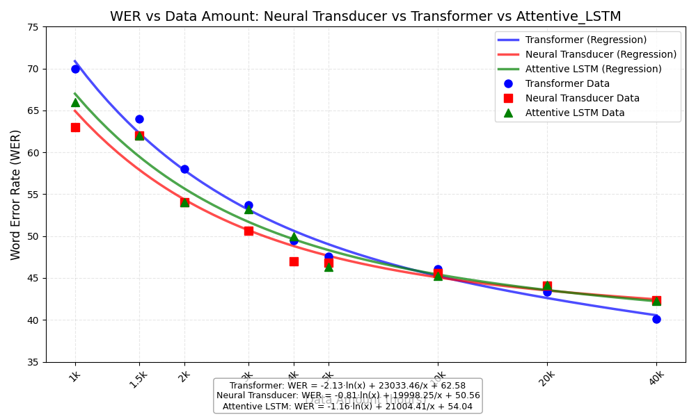

# Our Results

| Language                 | Pair n-Gram Model (baseline 2020) | Encoder-decoder Transformer (baseline 2020) | Neural Transducer (baseline 2021/22) | Attentive_LSTM (baseline 2024)|
|--------------------------|---------------------------------------|-------------------------------------------------|------------------------------------------|-----------------------------------|
| Adyghe                   | 27.00                                 | 39.00                                           | 20.00                                    | 30.00                             |
| Arabic                   | 43.00                                 | 43.00                                           | 53.00                                    | 45.00                             |
| Armenian (Eastern)       | 17.00                                 | 16.00                                           | 15.00                                    | 20.00                             |
| Assamese                 | 14.00                                 | 15.00                                           | 7.00                                     | 12.00                             |
| Belarusian               | 7.00                                  | 6.00                                            | 2.00                                     | 2.00                              |
| Bengali                  | 70.00                                 | 78.00                                           | 68.00                                    | 67.00                             |
| Bulgarian                | 37.00                                 | 30.00                                           | 32.00                                    | 27.00                             |
| Burmese                  | 39.00                                 | 41.00                                           | 29.00                                    | 35.00                             |
| Cebuano                  | 22.00                                 | 26.00                                           | 20.00                                    | 20.00                             |
| Central Khmer            | 56.00                                 | 43.00                                           | 31.00                                    | 35.00                             |
| Dutch                    | 32.00                                 | 29.00                                           | 24.00                                    | 23.00                             |
| Eastern Lawa             | 44.00                                 | 24.00                                           | 8.00                                     | 12.00                             |
| English                  | 70.00                                 | 70.00                                           | 63.00                                    | 66.00                             |
| French                   | 31.00                                 | 29.00                                           | 23.00                                    | 27.00                             |
| Georgian                 | 0.00                                  | 4.00                                            | 0.00                                     | 1.00                              |
| German                   | 49.00                                 | 56.00                                           | 46.00                                    | 45.00                             |
| Greek                    | 27.00                                 | 26.00                                           | 20.00                                    | 27.00                             |
| Hindi                    | 23.00                                 | 24.00                                           | 11.00                                    | 13.00                             |
| Hungarian                | 9.00                                  | 11.00                                           | 7.00                                     | 8.00                              |
| Icelandic                | 35.00                                 | 24.00                                           | 12.00                                    | 16.00                             |
| Indonesian               | 58.00                                 | 52.00                                           | 64.00                                    | 73.00                             |
| Irish                    | 57.00                                 | 46.00                                           | 43.00                                    | 39.00                             |
| Italian                  | 22.00                                 | 21.00                                           | 15.00                                    | 16.00                             |
| Japanese (Hiragana)      | 23.00                                 | 20.00                                           | 10.00                                    | 12.00                             |
| Korean                   | 81.00                                 | 89.00                                           | 23.00                                    | 100.00                            |
| Latvian                  | 51.00                                 | 51.00                                           | 51.00                                    | 50.00                             |
| Lithuanian               | 32.00                                 | 35.00                                           | 33.00                                    | 31.00                             |
| Macedonian               | 6.00                                  | 5.00                                            | 5.00                                     | 5.00                              |
| Maltese (Latin)          | 27.00                                 | 24.00                                           | 17.00                                    | 22.00                             |
| Norwegian Nynorsk        | 61.00                                 | 69.00                                           | 66.00                                    | 69.00                             |
| Pashto                   | 70.00                                 | 68.00                                           | 67.00                                    | 66.00                             |
| Persian (Classical)      | 51.00                                 | 58.00                                           | 57.00                                    | 51.00                             |
| Persian (Iranian)        | 66.00                                 | 63.00                                           | 65.00                                    | 65.00                             |
| Romanian                 | 10.00                                 | 17.00                                           | 9.00                                     | 17.00                             |
| Russian                  | 31.00                                 | 21.00                                           | 23.00                                    | 25.00                             |
| Serbo-Croatian (Latin)   | 84.00                                 | 69.00                                           | 64.00                                    | 69.00                             |
| Shan                     | 6.00                                  | 10.00                                           | 5.00                                     | 4.00                              |
| Slovenian                | 73.00                                 | 52.00                                           | 56.00                                    | 50.00                             |
| Spanish                  | 3.00                                  | 10.00                                           | 4.00                                     | 3.00                              |
| Swedish                  | 67.00                                 | 68.00                                           | 59.00                                    | 61.00                             |
| Tagalog                  | 11.00                                 | 17.00                                           | 13.00                                    | 11.00                             |
| Thai                     | 70.00                                 | 49.00                                           | 39.00                                    | 42.00                             |
| Ukrainian                | 27.00                                 | 26.00                                           | 19.00                                    | 18.00                             |
| Urdu                     | 67.00                                 | 66.00                                           | 72.00                                    | 77.00                             |
| Vietnamese (Hanoi)       | 44.00                                 | 20.00                                           | 5.00                                     | 4.00                              |
| Welsh                    | 33.00                                 | 20.00                                           | 12.00                                    | 19.00                             |
| Welsh (Southern Dialect) | 28.00                                 | 18.00                                           | 13.00                                    | 13.00                             |
| **Macro-average WER**    | **38.53**                             | **36.13**                                       | **29.79**                                | **32.56**                         |

---
# How Data Amount Affects Performance of Transformer Model

Comparing best performing model and transformer on different amount fo English data

| Data Amount | Neutral Transducer | Encoder-Decoder Transformer |
|-------------|--------------------|-----------------------------|
| 1k          | 63.00              | 70.00                       |
| 1.5k        | 62.00              | 64.00                       |
| 2k          | 54.00              | 58.00                       |
| 3k          | 50.67              | 53.67                       |
| 4k          | 47.00              | 49.50                       |
| 5k          | 46.80              | 47.60                       |
| 10k         | 45.60              | 46.10                       |
| 20k         | 44.05              | 43.35                       |
| 40k         | 42.38              | 40.10                       |

---
# Multilingual Approach
<!---
## How Language Family and Language Script affects
-->
- Same Language Family and Same Script

<table><thead>
  <tr>
    <th></th>
    <th></th>
    <th colspan="2">Multilingual</th>
    <th colspan="2">Monolingual</th>
  </tr></thead>
<tbody>
  <tr>
    <td>-Family +Script</td>
    <td>Language/Model</td>
    <td>Neural Transducer</td>
    <td>Encoder-decoder Transformer</td>
    <td>Neural Transducer</td>
    <td>Encoder-decoder Transformer</td>
  </tr>
  <tr>
    <td rowspan="3">-Germanic +Latin</td>
    <td>German</td>
    <td>48</td>
    <td>47</td>
    <td>46</td>
    <td>56</td>
  </tr>
  <tr>
    <td>Dutch</td>
    <td>25</td>
    <td>21</td>
    <td>24</td>
    <td>29</td>
  </tr>
  <tr>
    <td>Swedish</td>
    <td>62</td>
    <td>60</td>
    <td>59</td>
    <td>68</td>
  </tr>
  <tr>
    <td rowspan="3">-Romance +Latin</td>
    <td>Italian</td>
    <td>26</td>
    <td>22</td>
    <td>15</td>
    <td>21</td>
  </tr>
  <tr>
    <td>Spanish</td>
    <td>12</td>
    <td>3</td>
    <td>4</td>
    <td>10</td>
  </tr>
  <tr>
    <td>Romanian</td>
    <td>18</td>
    <td>13</td>
    <td>9</td>
    <td>17</td>
  </tr>
  <tr>
    <td rowspan="3">-Slavic +Cyrillic</td>
    <td>Bulgarian</td>
    <td>34</td>
    <td>27</td>
    <td>32</td>
    <td>30</td>
  </tr>
  <tr>
    <td>Russian</td>
    <td>33</td>
    <td>18</td>
    <td>23</td>
    <td>21</td>
  </tr>
  <tr>
    <td>Ukrainian</td>
    <td>26</td>
    <td>27</td>
    <td>19</td>
    <td>26</td>
  </tr>
</tbody></table>

--- 
# Reference Result from previous shared task
## 2022

### Model
**Baseline**: A neural transducer system using an imitation learning paradigm (dyNET framework)

**Submissions**:
1. [Tü-G2P](https://aclanthology.org/2023.sigmorphon-1.28.pdf): A series of sequence labelling systems to G2P tasks,
   which use ​simpler alignment​ rather than dynamic transducer-based alignment.(Pytorch)
2. [Hammond](https://aclanthology.org/2023.sigmorphon-1.29.pdf) ([Repo](https://github.com/hammondm/g2p2022)): A
   non-neural system based on OpenFST and uses weighted finite-state transducers and expectation-maximization to compute
   the best many-to-many alignment of letters and phonetic symbol
3. ~~[mSLAM](https://aclanthology.org/2023.sigmorphon-1.31.pdf): Non-archival; abstract only;~~ useless
4. ~~[NFST](https://aclanthology.org/2023.sigmorphon-1.30.pdf): Non-archival; abstract only;~~ useless

### Reference Result:

- Baseline

| Language | Bengali | Burmese | German | Irish | Italian | Persian | Swedish | Tagalog | Thai  | Ukrainian | Macro-average |
|----------|---------|---------|--------|-------|---------|---------|---------|---------|-------|-----------|---------------|
| WER      | 67.12   | 29.00   | 42.00  | 38.00 | 15.00   | 59.65   | 45.00   | 20.00   | 21.00 | 32.00     | 36.88         |

- Hammond (trigram alignment)

| Language | Bengali | Burmese | German | Irish | Italian | Persian | Swedish | Tagalog | Thai  | Ukrainian | Macro-average |
|----------|---------|---------|--------|-------|---------|---------|---------|---------|-------|-----------|---------------|
| WER      | 68.49   | 48.00   | 61.00  | 51.00 | 25.00   | 67.86   | 55.00   | 18.00   | 72.00 | 50.00     | 51.63         |

## 2024

### Model
**Baseline**: attentive_gru, attentive_lstm, gru, hard_attention_gru, lstm, pointer_generator_gru, transducer_gru, transformer(20\40\60 epochs)

### Reference Result:

- Baseline

| Models                | gru   | lstm  | attentive_gru | attentive_lstm | hard_attention_gru | hard_attention_gru (Arab) | pointer_generator_gru | transducer_gru | transformer_20 | transformer_40 | transformer_60 |
|-----------------------|-------|-------|---------------|----------------|--------------------|---------------------------|-----------------------|----------------|----------------|----------------|----------------|
| WER (%)               | 43.75 | 44.25 | 63.08         | 47.25          | 40.67              | 31.33                     | 62.17                 | 69.33          | 78.25          | 81.58          | 79.50          |

- Best performance model on all datasets(hard_attenton_gru)

| Languages  | Arabic | Bulgarian | English | Persian | Indonesian | Macedonian | Pashto | Russian | Spanish | Tagalog | Ukrainian | Urdu   |
|------------|--------|-----------|---------|---------|------------|------------|--------|---------|---------|---------|-----------|--------|
| WER        | 31.33  | 20.00     | 58.00   | 29.67   | 55.33      | 3.67       | 44.33  | 10.33   | 5.00    | 40.33   | 15.67     | 64.00  |

- GRU、LSTM、Transformer on different languages
  
| Model/Languages   | English | Pashto | Russian | Spanish |
|-------------------|---------|--------|---------|---------|
| GRU               | 31.00   | 39.00  | 14.00   | 9.00    |
| LSTM              | 48.33   | 57.67  | 10.33   | 9.00    |
| Transformer       | 81.33   | 77.00  | 35.67   | 24.67   |

- Comparison among hard_attention_gru、attentive_gru、attentive_lstm 

| Model / Language    | Korean | Bengali | Indonesian | Pashto | Swedish |
|---------------------|--------|---------|------------|--------|---------|
| hard_attention_gru  | 98.00  | 74.00   | 70.00      | 78.00  | 66.00   |
| attentive_lstm      | 100.00 | 67.00   | 73.00      | 66.00  | 61.00   |

- Comparison between attentive_gru and attentive_lstm

The comparison of validation accuracy (val_accuracy) between attentive_gru (GRU) and attentive_lstm (LSTM) across all languages shows:

- LSTM val_accuracy higher than GRU: 20 times  
- LSTM val_accuracy lower than GRU: 22 times  
- LSTM val_accuracy equal to GRU: 6 times  
- Average LSTM val_accuracy: 0.6987  
- Average GRU val_accuracy: 0.7049  

This indicates that, on average, attentive_gru achieves slightly higher validation accuracy than attentive_lstm, although the performance varies across different languages.

- attentive_lstm performance on Adyghe and Bengali with different parameters(DEV_WER)

| Params                                      | Adyghe WER | Bengali WER | Dutch WER | Urdu WER |
|---------------------------------------------|------------|-------------|-----------|----------|
| default                                     | 31.00      | 65.00       | 23.00     | 77.00    |
| 4 encoder_layers + 1 decoder_layer          | 51.00      | 70.00       | 45.00     | 80.00    |
| 256 embedding_size + 1024 hidden_size       | 37.00      | 67.00       | 30.00     | 78.00    |
| 0.1 label_smoothing                         | 33.00      | 65.00       | 21.00     | 75.00    |